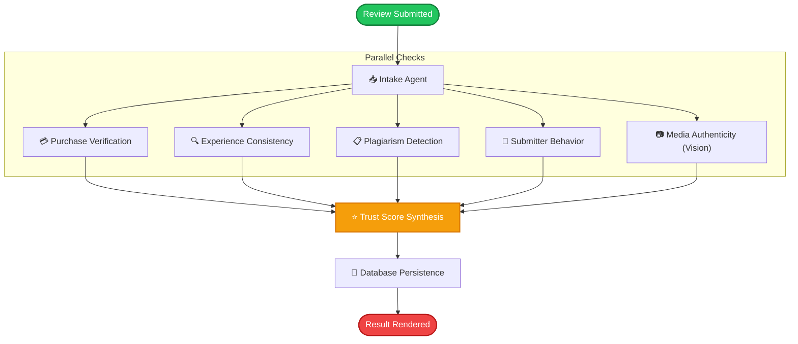

# 🛡️ TrustLens — AI Review Verification System

An advanced, full-stack review credibility verification engine. Powered by a multi-agent **LangGraph** orchestration pipeline, the system verifies order authenticity, checks cross-experience consistency, detects copy-paste reviews, analyzes user behavior patterns, performs multimodal vision analysis on uploaded media, and compiles a final composite **Trust Score** to combat fake reviews.

---

## 📌 Project Overview

**TrustLens** is an intelligent auditing system designed to bring transparency back to online marketplaces. By treating review analysis as a collective intelligence problem, TrustLens runs customer reviews through a strict **7-Agent LangGraph pipeline**. It references transaction records, validates customer experience logic, checks for plagiarism, profiles submitter patterns, and scans images for forgery or context mismatches—creating an automated, tamper-proof audit trail for every submitted review.

---

## ⚠️ Problem Statement

In the digital commerce era, trust is a currency. However:
1. **Review Forgery & Astroturfing**: Businesses buy fake positive reviews, while competitors deploy negative bot reviews.
2. **Visual Misrepresentation**: Shills upload generic stock photos, screenshots of other platforms, or AI-generated images to appear as verified buyers.
3. **High Moderation Costs**: Manually verifying receipts, matching text consistency, and checking user submission patterns is slow, expensive, and error-prone.

**TrustLens** solves this by leveraging structured multi-agent workflows. It connects LLMs with live SQLite order databases and vision analysis to flag suspicious submissions programmatically in milliseconds.

---

## ⚡ Features

### 🤖 Multi-Agent LangGraph Audit Pipeline
- **Review Intake Agent**: Triggers and dynamically routes tasks based on review contents.
- **Purchase Verification Agent**: Cross-references invoices, item SKUs, and purchase history from the transaction database.
- **Experience Consistency Agent**: Critiques text content to ensure descriptions align with the business type (e.g., ensuring a laptop review doesn't mention "delicious crust").
- **Duplicate Detection Agent**: Employs text matching to block plagiarized or spun content.
- **Reviewer Behavior Agent**: Analyzes historical submission frequency and speed metrics to detect bot farms.
- **Media Authenticity Agent**: Uses **Llama 4 Scout Vision** to check if uploaded images match the text description and are authentic (detecting stock images, memes, and AI generation).
- **Trust Score Agent**: Synthesizes all independent agent feedback into a structured confidence index (0-100%) and actionable recommendation (`Approve`, `Review`, `Reject`).

### 🎨 Premium User Interface
- Beautiful modern frontend dashboard created with **React**, **Vite**, **Framer Motion**, and **Lucide React**.
- Real-time visualization of the LangGraph pipeline execution state.
- Interactive **Bento-grid** dashboard summarizing review stats.
- Clean order receipt lookup tool and rich review history tracking.

---

## 🛠️ Tech Stack

| Layer | Technologies Used |
| :--- | :--- |
| **Frontend** | React 19, Vite, React Router, Framer Motion, Lucide React |
| **Backend** | FastAPI, Python 3, Pydantic, Uvicorn |
| **Database** | SQLite3 (Zero-setup local database) |
| **AI Orchestration** | LangGraph, LangChain, Groq Cloud |
| **LLM Models** | Llama 3.3 70B (text reasoning), Llama 4 Scout (vision analysis) |
| **Observability** | LangSmith Tracing |

---

## 📐 Pipeline Architecture

The flow of verification is orchestrated as a state graph:



---

## 🚀 Setup Instructions

### 📦 Prerequisites
- **Python 3.10+**
- **Node.js 18+**
- **Groq API Key** (Get free keys at [Groq Console](https://console.groq.com))

---

### 🔧 1. Backend Setup

1. Navigate to the backend directory:
   ```bash
   cd backend
   ```

2. Create a virtual environment and activate it:
   ```bash
   python3 -m venv venv
   source venv/bin/activate
   ```

3. Install dependencies:
   ```bash
   pip install -r requirements.txt
   ```

4. Set up environment variables:
   ```bash
   cp .env.example .env
   ```
   Edit the `.env` file to add your API keys:
   ```env
   GROQ_API_KEY_1=your_groq_api_key_1_here
   GROQ_API_KEY_2=your_groq_api_key_2_here
   GROQ_API_KEY_3=your_groq_api_key_3_here
   
   # Optional: LangSmith Tracing
   LANGSMITH_API_KEY=your_langsmith_api_key_here
   LANGCHAIN_TRACING_V2=true
   LANGCHAIN_PROJECT=ai-review-verification-system
   ```

5. Launch the backend server:
   ```bash
   uvicorn app.main:app --reload --port 8000
   ```
   The backend will auto-initialize the database, seed mock orders, and run at `http://127.0.0.1:8000`.

---

### 💻 2. Frontend Setup

1. Navigate to the frontend directory:
   ```bash
   cd frontend
   ```

2. Install dependencies:
   ```bash
   npm install
   ```

3. Set up environment variables (Optional, defaults to backend port 8000):
   ```bash
   echo "VITE_API_URL=http://127.0.0.1:8000" > .env
   ```

4. Run the development server:
   ```bash
   npm run dev
   ```
   Open your browser to the local URL (typically `http://localhost:5173`).

---

## 👥 Team Details

| Name | Role | GitHub Profile |
| :--- | :--- | :--- |
| **[Your Name]** | Lead Developer / AI Architect | [@username](https://github.com/username) |
| **[Partner Name]** | Frontend Developer | [@username](https://github.com/username) |

---

## 🔗 Demo Links

- **Working Demo Video**: [Watch Demo Video](https://youtube.com/link_to_your_video)
- **Live Deployment Link**: [Access App Live](https://yourprojectlink.vercel.app)
- **GitHub Repository**: [Source Code](https://github.com/username/project-repo)
